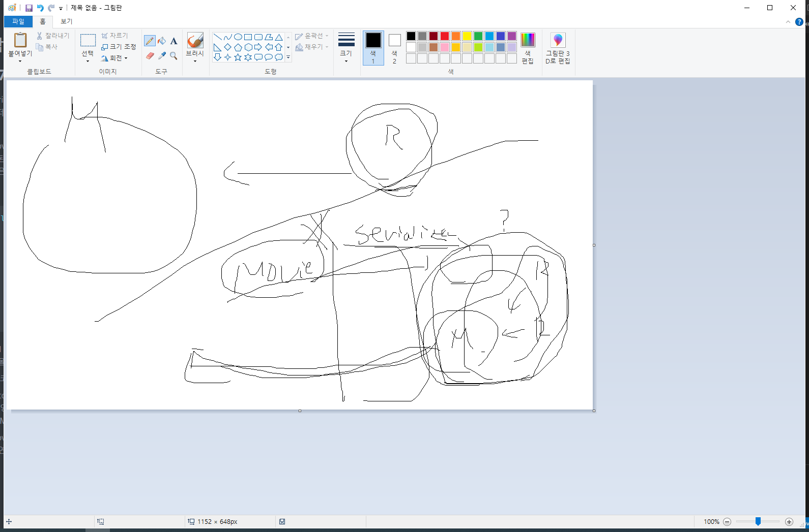

# 박단비 README.md

# 07_pjt

serializers를 사용하기 위해서는 from    rest_framework     import     serializers을 해야하는데 그러기 위해서는 settings.py에 INSTALLED_APPS에 'rest_framework'를 입력해야한다.


Movie 모델에 release_data 필드는 여기서는 영화 데이터를 추가하는게 없고, json파일에 입력된 데이터만 읽어오기 때문에 models.DateTimeField()에 auto_now나 auto_now_add   같은 속성을 굳이 주지 않아도 됩니다. 


```python
class ActorDetailSerializer(serializers.ModelSerializer):
    class MovieTitleSerializer(serializers.ModelSerializer):
        class Meta:
            model = Movie
            fields = ('title',)
            
    movies = MovieTitleSerializer(many=True,read_only=True)
    class Meta:
        model = Actor
        fields = '__all__'
```

N:1 관계에서 참조하는 모델의 필드를 가져오려면 serializer 내부에 serializer를 만들어서 가져올 수 있습니다.

위 코드를 한줄 씩 해석하면

ActorDetail 정보를 가져오는 serializer는  영화 제목을 가져와야하기 때문에 내부에 참조하는 영화 모델의 title을 가져오는 MovieTitleSerializer 를 만들어줍니다. MovieTitleSerializer은 Movie 모델에서 데이터를 가져오고, 그 중에서 title 필드만 가져옵니다.

MovieTitleSerializer를 이용해서 movies에 데이터를 받아옵니다. 배우 한명은 여러 영화에 출연할 수 있기 때문에 many=True를 지정해줍니다. 그리고 Serializer는 데이터를 받아올 때도 세트로 받아오려고 하기 때문에 read_only=True를 줘서 영화 정보는 입력할때는 우선 무시한다고 둡니다.





```python
class MovieDetailSerializer(serializers.ModelSerializer):
    class ReviewTitleContentSerializer(serializers.ModelSerializer):
        class Meta:
            model = Review
            fields = ('title','content',)
    
    class ActorNameSerializer(serializers.ModelSerializer):
        class Meta:
            model = Actor
            fields = ('name',)

    actors = ActorNameSerializer(many=True,read_only=True)
    review_set = ReviewTitleContentSerializer(many=True,read_only=True)
    
    
    class Meta:
        model = Movie
        fields = '__all__'
```

영화 세부 데이터를 주는 MovieDetailSerializer는 리뷰정보와 배우 정보를 가져와야하기 때문에 내부에 serializer를 2개를 만들어줍니다.


```python
class ReviewDetailSerializer(serializers.ModelSerializer):
    class MovieTitleSerializer(serializers.ModelSerializer):
        class Meta:
            model = Movie
            fields = ('title',)
            
    movie = MovieTitleSerializer(read_only=True)
    class Meta:
        model = Review
        fields = '__all__'
```

리뷰 세부 데이터를 주는ReviewDetailSerializer는 영화정보를 가져와야하기 때문에 내부에 MovieTitleSerializer를 만들어주는데 하나의 리뷰는 하나의 영화에만 존재하기 때문에 movie = MovieTitleSerializer(read_only=True)에는 many=True 값을 주면 안됩니다.


```python
class ReviewTitleSerializer(ReviewListSerializer):
    def to_representation(self,instance):
    rep = super().to_representation(instance)
    # rep = dict(filter(lambda x : x[0]=='title',rep.items()))
    rep.pop('content',None)
    rep.pop('movie',None)
    rep.pop('id',None)
    return rep
```

serializer 내부에 새로운 serializer를 만들지 않으려면 이렇게 작성해서 필요없는 필드들을 없애는 방법으로도 할 수 있습니다.
